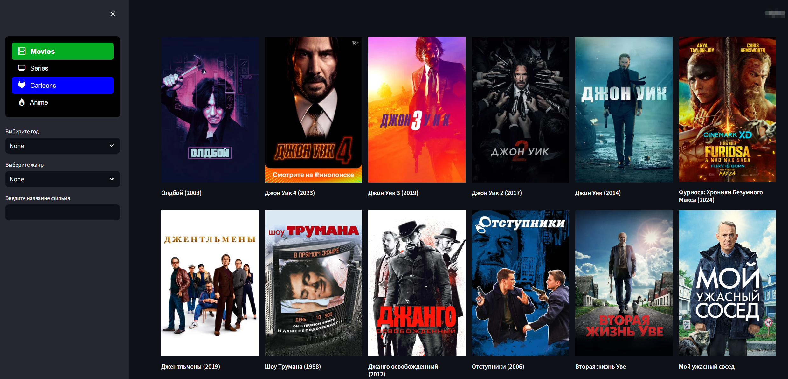

# MovieApp



Это веб-приложение на Streamlit для просмотра информации о фильмах. Пользователь может фильтровать фильмы по году выпуска, жанру и названию. Пагинация обеспечивает удобную навигацию между страницами результатов.

## Установка

1. Установите необходимые зависимости, выполнив следующую команду:

```bash
pip install streamlit streamlit_option_menu streamlit_pagination
Склонируйте репозиторий:
bash
Копировать код
git clone https://github.com/<ваш-логин>/MovieApp.git
cd MovieApp
Использование
Запустите приложение, введя следующую команду:
bash
Копировать код
streamlit run app.py
Выберите желаемые параметры фильтрации (год, жанр, название фильма) в боковой панели.
Используйте кнопки "← Назад" и "Вперед →" для перемещения между страницами.
Нажмите на изображение фильма или его название, чтобы просмотреть подробности и перейти к просмотру.
Структура проекта
app.py: Основной код приложения.
movies.json: JSON файл с данными о фильмах.
series.json, cartoons.json, anime.json: Дополнительные JSON файлы с данными о сериалах, мультфильмах и аниме соответственно.
screenshot.png: Скриншот приложения для демонстрации.